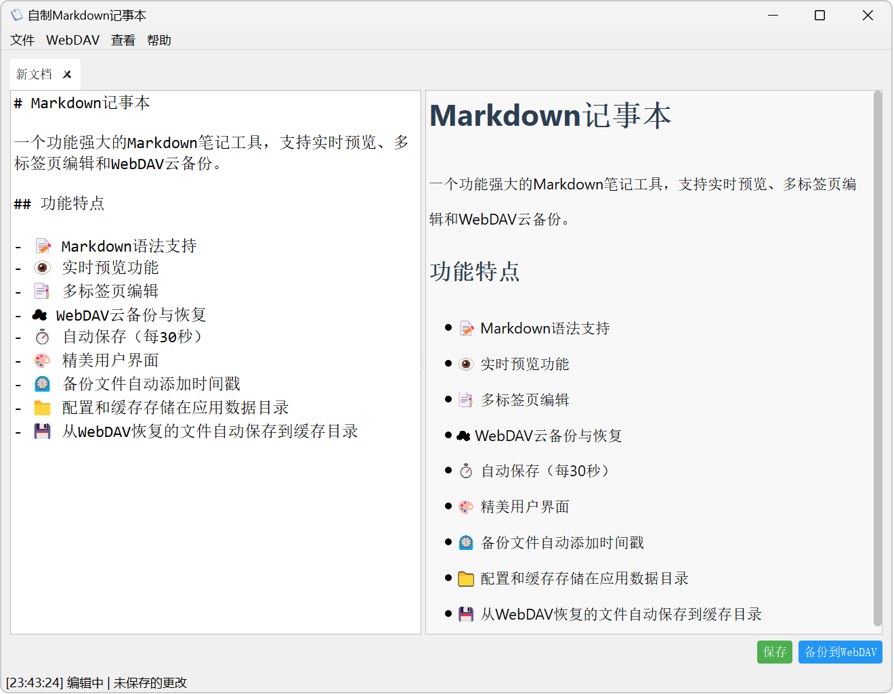

# Markdown记事本

一个功能强大的Markdown笔记工具，支持实时预览、多标签页编辑和WebDAV云备份。

## 界面示意图

程序主界面如下所示：



## 功能特点

- 📝 Markdown语法支持
- 👁️ 实时预览功能
- 📑 多标签页编辑
- ☁️ WebDAV云备份与恢复
- ⏱️ 自动保存（每30秒）
- 🎨 精美用户界面
- ⏲️ 备份文件自动添加时间戳
- 📁 配置和缓存存储在应用数据目录
- 💾 从WebDAV恢复的文件自动保存到缓存目录

## 打包指南

直接双击运行 `build.bat` 脚本即可自动安装所需依赖并自动打包，打包后的可执行文件位于 `/dist` 目录中

### 依赖安装

在运行前，请确保安装以下依赖：

```bash
pip install PyQt5 requests markdown
